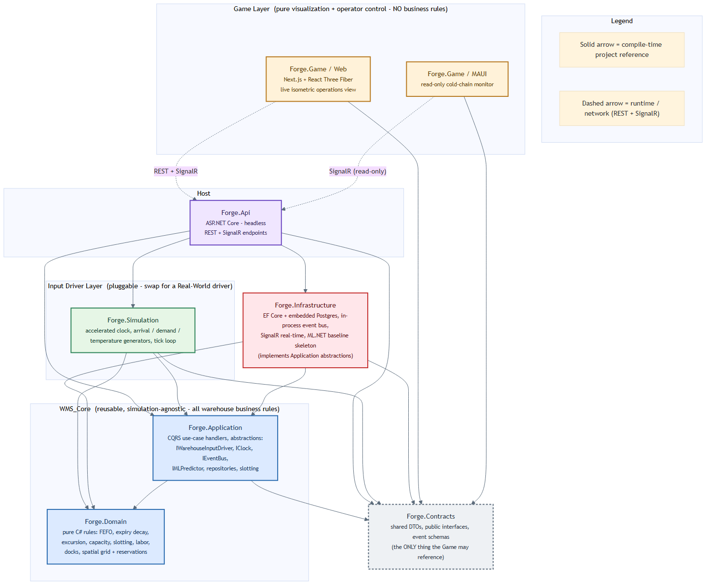

# Forge

**Forge - Food Organization and Resource Guidance Engine**

A full Warehouse Management System (WMS), a warehouse simulation, and a visual management tool ("the game") for a futuristic food-gel distribution center.

## Project Goal

Forge delivers three things that fit together as one solution:

1. **A full WMS** - a reusable, simulation-agnostic warehouse management core containing all warehouse business rules (FEFO selection, expiry/shelf-life decay, cold-chain temperature control, capacity limits, velocity/affinity slotting, labor-cost modeling, dock scheduling, spatial movement and contention, ML-backed demand forecasting with human-in-the-loop override). It is designed to be dropped into a real warehouse as a digital-twin/WMS foundation and runs fully headless.

2. **A simulation** - a pluggable input driver that feeds the WMS the inputs a real warehouse would otherwise receive: continuous inbound gel arrivals, evolving colony demand, and temperature readings, all advanced by a controllable (real-time or accelerated) clock. The simulation is what exercises the WMS; in a real deployment it would be swapped for a real-world driver with no change to the core.

3. **A visual management tool (the game)** - a live, top-down/isometric operations view in the style of a warehouse-management tycoon game. Operators watch agents move, spot congestion, tune live parameters, and review/override forecasts. It is a pure visualization and control surface with no business rules of its own, plus a read-only mobile cold-chain monitor.

## Theme

To make this more engaging, Forge is framed as a futuristic food-gel distribution center whose job is to fully manage the flow of resources to various off-world colonies. The warehouse sits as a constrained middle bottleneck between continuous inbound receiving and outbound shipping to colonies via starships.

## Approach

The project is built with spec-driven, AI-assisted development. After a thorough specification session, the work is broken into independent, verifiable tasks.

## Phase 1 Game Plan

The build order is deliberate, with the reusable value component first:

1. **WMS core** - build the reusable warehouse management engine (domain + application).
2. **Simulation** - build the input driver that generates arrivals, demand, and temperature readings.
3. **Visual management tool (the game)** - build the web operations view and the mobile monitor.

After the three layers are in place, the WMS is documented in depth: which typical warehouse problems it solves today, where the current implementation can be enhanced, and what is planned for future phases. See [`documents/WMS_solutions.md`](documents/WMS_solutions.md) for that mapping of common WMS problems to their solutions.

## Architecture at a Glance

*The diagram above shows the project reference graph (solid arrows) and runtime transport (dashed arrows). Source: [`documents/architecture.mmd`](documents/architecture.mmd) (Mermaid); rendered copies in [`documents/architecture.png`](documents/architecture.png) and [`documents/architecture.svg`](documents/architecture.svg). Re-render with `npx @mermaid-js/mermaid-cli -i documents/architecture.mmd -o documents/architecture.png -b white -w 1600`.*

- **WMS_Core** (`Forge.Domain` + `Forge.Application`) - all business rules; depends only on abstractions; contains no input-generation logic.
- **Input_Driver** (`Forge.Simulation`) - supplies the core inputs; replaceable by a real-world driver.
- **Game** (`Forge.Game`) - Next.js web operations view + MAUI read-only cold-chain monitor; renders authoritative state only.
- Supporting projects: `Forge.Contracts` (shared DTOs/event schemas), `Forge.Infrastructure` (persistence, event bus, real-time transport, ML skeleton), and `Forge.Api` (headless REST + SignalR host).
